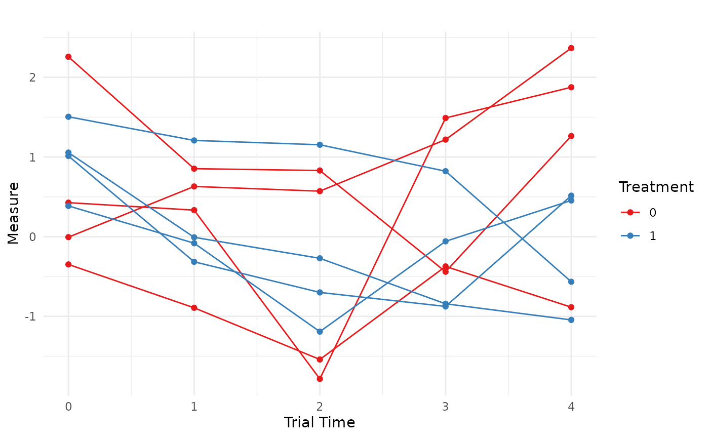

# Simulating Longitudinal Data with \`endpoints\`

``` r
library(endpoints)
library(tidyverse)
```

## Introduction

There are two ways in which the `endpoints` package can be used to
generate longitudinal data. The first is by directly generating
correlated outcomes and the second is by generating random random
effects. Examples of each method can be found below.

## Correlated Responses

### Longitudinal Data Only

Suppose we want to simulate a longitudinal continuous outcome measured
at a fixed set of visits, with trajectories that differ by treatment
group. For illustration, consider the marginal mean model

\\ Y\_{i t}=\beta_0+\beta\_{\text {time }} t+\beta\_{\text {trt }}
x_i+\boldsymbol\beta\_{\text {time:trt }} t x_i+\varepsilon\_{i t},
\quad i=1, \ldots, n, \quad t \in\\0,1, \ldots, T-1\\, \\

where \\x_i \in\\0,1\\\\ is the treatment indicator and the residual
vector \\\varepsilon_i=\left(\varepsilon\_{i 0}, \ldots,
\varepsilon\_{i, T-1}\right)^{\top}\\ follows

\\ e_i \sim \mathcal{N}\left(\mathbf{0}, \sigma^2 \mathbf{V}\right),
\quad \mathbf{V}\_{t t^{\prime}}=\rho^{\left\|t-t^{\prime}\right\|} \\

Here \\\mathbf{V}\\ is the standard AR(1) correlation structure:
measurements closer in time are more strongly correlated. More
explicitly, this can be written as

\\\mathbf{V}=\left(\begin{array}{ccccc}1 & \rho & \rho^2 & \cdots &
\rho^{n-1} \\ \rho & 1 & \rho & \cdots & \rho^{n-2} \\ \rho^2 & \rho & 1
& \cdots & \rho^{n-3} \\ \vdots & \vdots & \vdots & \ddots & \vdots \\
\rho^{n-1} & \rho^{n-2} & \rho^{n-3} & \cdots & 1\end{array}\right)\\

In this example we use:

- \\\mathrm{AR}(1)\\ correlation \\\rho=0.5\\,
- \\T=5\\ visits (baseline + 4 follow-up visits),
- a constant control-group mean over time,
- a non-linear treatment effect across visits,
- residual SD \\\sigma=0.95\\.

**Step 1: Specify the within-subject correlation**

We encode the AR(1) structure directly using
[`corr_make()`](https://boehringer-ingelheim.github.io/endpoints/reference/corr_make.md):

``` r
N_visits <- 5 
rho <- 0.5

corMat_5_visits <- corr_make(
  num_endpoints = N_visits,
  values = rbind(
    c(1,2,rho), c(1,3,rho^2), c(1,4,rho^3),c(1,5,rho^4),
    c(2,3,rho), c(2,4,rho^2), c(2,5,rho^3),
    c(3,4,rho), c(3,5,rho^2),
    c(4,5,rho)
  )
)
```

**Step 2: Treat each visit as a “correlated endpoint”**

Although `endpoint_details` typically describes distinct endpoints, we
can also use it to represent distinct visits of a single longitudinal
outcome. Each entry below specifies the marginal mean at a visit for
control, plus the visit-specific treatment effect.

``` r
sigma <- 0.95 # constant residual error

baseline <- list(
  endpoint_type = "continuous",
  baseline_mean = 0.45,
  trt_effect    = 0,     # no baseline difference
  sd            = sigma
)

v1 <- list(endpoint_type = "continuous", baseline_mean = 0.45, trt_effect = -0.10, sd = sigma)
v2 <- list(endpoint_type = "continuous", baseline_mean = 0.45, trt_effect = -0.15, sd = sigma)
v3 <- list(endpoint_type = "continuous", baseline_mean = 0.45, trt_effect = -0.25, sd = sigma)
v4 <- list(endpoint_type = "continuous", baseline_mean = 0.45, trt_effect = -0.40, sd = sigma)
```

**Step 3: Simulate wide data with makeData()**

``` r
correlated_visits_wide <- makeData(
  correlation_matrix    = corMat_5_visits,
  SEED                  = 321,
  sample_size_per_group = 2000,   # large n to check asymptotic behavior
  endpoint_details      = list(baseline, v1, v2, v3, v4)
)
```

``` r
knitr::kable(
  head(correlated_visits_wide$data),
  caption = "Wide data returned by makeData() (one column per visit)"
)
```

|     Cont_1 |     Cont_2 |     Cont_3 |     Cont_4 |     Cont_5 | trt |
|-----------:|-----------:|-----------:|-----------:|-----------:|----:|
|  0.9136632 |  1.0368596 | -0.7689901 | -0.0544426 | -0.3515110 |   0 |
|  0.0962094 | -0.6043165 |  0.0005888 |  1.8262149 |  1.1259233 |   0 |
|  0.3072042 |  0.0331833 |  0.3730946 |  0.4594899 |  1.7044212 |   0 |
| -0.8548549 | -0.9062046 | -0.6185425 | -0.4540785 |  0.4544898 |   0 |
| -0.5574394 | -1.0931459 |  0.3318037 | -0.0710577 |  0.6245473 |   0 |
|  0.6971626 |  1.1483199 |  1.5965616 |  0.8228409 | -0.0226198 |   0 |

Wide data returned by makeData() (one column per visit)

At this stage we have a standard “wide” format dataset: each visit
appears as a separate column (`Cont_1`, …, `Cont_5`). The key
observation is that a collection of correlated endpoints can be
interpreted as repeated measures once we reshape the data.

**Step 4: Convert wide \\\rightarrow\\ long**

``` r
library(tidyverse)
correlated_visits_long <- 
  correlated_visits_wide$data %>%
  rowid_to_column('ID') %>% # keep track of patient
  gather(.,key="visit",value='Measure',-trt,-ID) %>%   # convert wide to long data
  mutate(ID = as.factor(ID),
         # clean up names
         visit  = case_match(visit,
                             "Cont_1" ~ 0,
                             "Cont_2" ~ 1,
                             "Cont_3" ~ 2,
                             "Cont_4" ~ 3,
                             "Cont_5" ~ 4)) %>%
  arrange(ID)
```

The long data now looks like a typical longitudinal dataset:

``` r
knitr::kable(
  head(correlated_visits_long),
  caption = "Longitudinal data after reshaping to long format"
)
```

| ID  | trt | visit |    Measure |
|:----|----:|------:|-----------:|
| 1   |   0 |     0 |  0.9136632 |
| 1   |   0 |     1 |  1.0368596 |
| 1   |   0 |     2 | -0.7689901 |
| 1   |   0 |     3 | -0.0544426 |
| 1   |   0 |     4 | -0.3515110 |
| 2   |   0 |     0 |  0.0962094 |

Longitudinal data after reshaping to long format

**Step 5: Validate the intended effects and correlation**

To verify that the simulated data reflect the intended mean structure
and AR(1) correlation, we fit a marginal model using
[`geeM::geem()`](https://rdrr.io/pkg/geeM/man/geem.html):

``` r
ge1 <- geeM::geem(
  Measure ~ factor(visit) * trt,
  id     = ID,
  corstr = "ar1",
  data   = correlated_visits_long,
  family = gaussian
)
```

Inspecting the output from the model, we observe that the simulation
proceeded correctly:

``` r
est_effects <- c(
  round(summary(ge1)$beta[7:10], 3),  # treatment effects at visits 1-4 (vs baseline)
  round(summary(ge1)$phi, 2),         # residual SD (see note below)
  round(summary(ge1)$alpha, 2)        # AR(1) correlation estimate
)

true_effects <- c(-0.10, -0.15, -0.25, -0.40, sigma, rho)

labels_latex <- c(
  "$\\beta_{\\mathrm{trt},1}$",
  "$\\beta_{\\mathrm{trt},2}$",
  "$\\beta_{\\mathrm{trt},3}$",
  "$\\beta_{\\mathrm{trt},4}$",
  "$\\sigma$",
  "$\\rho$"
)

out_tbl <- data.frame(
  Parameter = labels_latex,
  True      = true_effects,
  Estimated = est_effects
)

knitr::kable(
  out_tbl,
  escape = FALSE,
  digits = 3,
  caption = "True vs. estimated longitudinal treatment effects and correlation parameters."
)
```

| Parameter                   |  True | Estimated |
|:----------------------------|------:|----------:|
| \\\beta\_{\mathrm{trt},1}\\ | -0.10 |    -0.123 |
| \\\beta\_{\mathrm{trt},2}\\ | -0.15 |    -0.179 |
| \\\beta\_{\mathrm{trt},3}\\ | -0.25 |    -0.260 |
| \\\beta\_{\mathrm{trt},4}\\ | -0.40 |    -0.430 |
| \\\sigma\\                  |  0.95 |     0.910 |
| \\\rho\\                    |  0.50 |     0.510 |

True vs. estimated longitudinal treatment effects and correlation
parameters.

(Note: \\\sigma\\ is the marginal residual SD in \\\varepsilon\_{it}
\sim N(0,\sigma^2\mathbf{V})\\)

We now have a longitudinal data set with the correct data
characteristics to use in simulation. Finally, we can visualize a small
set of subject trajectories:

``` r
set.seed(888)
IDs = c(sample(1:4000,8)) 
correlated_visits_long %>%
  filter(.,ID %in% IDs) %>%
  ggplot(.,aes(x = visit,y=Measure,group = ID,color = as.factor(trt)))+
  geom_line() +
  geom_point() +
  labs(title = "",
       x = "Trial Time",
       y = "Measure",
       color = "Treatment") +
  theme_minimal()+
  scale_color_brewer(palette = "Set1")
```



### Longitudinal Data with Other Endpoints

To correlate longitudinal measurements with additional endpoints (e.g.,
a time-to-event outcome), we expand:

1.  the correlation matrix to include the new endpoint(s), and
2.  the `endpoint_details` list to include a TTE specification,

then reshape only the longitudinal columns while keeping the additional
endpoint columns in place.

**Example: add a non-fatal hospitalization endpoint (TTE)**

Here we assume an exchangeable within-visit correlation for simplicity,
and specify correlations between hospitalization time and each visit.

``` r
rho <- 0.15

corMat_long_w_hosp <- corr_make(
  num_endpoints = 6,
  values = rbind(
    # exchangeable correlation among visits (1...5)
    c(1,2,rho), c(1,3,rho), c(1,4,rho), c(1,5,rho),
    c(2,3,rho), c(2,4,rho), c(2,5,rho),
    c(3,4,rho), c(3,5,rho),
    c(4,5,rho),

    # correlations between visits and hospitalization (endpoint 6)
    c(1,6,0.00), c(2,6,0.10), c(3,6,0.20), c(4,6,0.25), c(5,6,0.15)
  )
)
```

We specify hospitalization as a non-fatal TTE endpoint (no censoring
here for simplicity):

``` r
hosp <- list(
  endpoint_type  = "tte",
  baseline_rate  = 1/2,        
  trt_effect     = log(0.80),   
  fatal_event    = FALSE     
)
```

Simulate the data:

``` r
wide_w_hosp <- makeData(
  correlation_matrix    = corMat_long_w_hosp,
  SEED                  = 123,
  sample_size_per_group = 2000,
  endpoint_details      = list(baseline, v1, v2, v3, v4, hosp)
)
```

It is often helpful to verify the simulated marginals and (approximate)
correlation structure before reshaping:

``` r
summary(wide_w_hosp)
```

Show summary(wide_w_hosp)


    n_arms: 2 

    Target correlation:
         [,1] [,2] [,3] [,4] [,5] [,6]
    [1,] 1.00 0.15 0.15 0.15 0.15 0.00
    [2,] 0.15 1.00 0.15 0.15 0.15 0.10
    [3,] 0.15 0.15 1.00 0.15 0.15 0.20
    [4,] 0.15 0.15 0.15 1.00 0.15 0.25
    [5,] 0.15 0.15 0.15 0.15 1.00 0.15
    [6,] 0.00 0.10 0.20 0.25 0.15 1.00

    Estimated correlation (by arm):

    arm_0:
           Cont_1 Cont_2 Cont_3 Cont_4 Cont_5  TTE_1
    Cont_1  1.000  0.165  0.126  0.137  0.143 -0.023
    Cont_2  0.165  1.000  0.169  0.188  0.088  0.095
    Cont_3  0.126  0.169  1.000  0.179  0.151  0.211
    Cont_4  0.137  0.188  0.179  1.000  0.158  0.220
    Cont_5  0.143  0.088  0.151  0.158  1.000  0.155
    TTE_1  -0.023  0.095  0.211  0.220  0.155  1.000

    arm_1:
           Cont_1 Cont_2 Cont_3 Cont_4 Cont_5  TTE_1
    Cont_1  1.000  0.134  0.104  0.129  0.154 -0.008
    Cont_2  0.134  1.000  0.165  0.150  0.154  0.082
    Cont_3  0.104  0.165  1.000  0.111  0.095  0.178
    Cont_4  0.129  0.150  0.111  1.000  0.081  0.215
    Cont_5  0.154  0.154  0.095  0.081  1.000  0.122
    TTE_1  -0.008  0.082  0.178  0.215  0.122  1.000

    Continuous endpoints (endpoint x arm):
       endpoint arm input_baseline_mean input_sd input_trt_effect est_baseline_mean
    1    Cont_1   0                0.45     0.95             0.00         0.4422988
    2    Cont_1   1                0.45     0.95             0.00         0.4422988
    3    Cont_2   0                0.45     0.95             0.00         0.4430401
    4    Cont_2   1                0.45     0.95            -0.10         0.4430401
    5    Cont_3   0                0.45     0.95             0.00         0.4433510
    6    Cont_3   1                0.45     0.95            -0.15         0.4433510
    7    Cont_4   0                0.45     0.95             0.00         0.4581812
    8    Cont_4   1                0.45     0.95            -0.25         0.4581812
    9    Cont_5   0                0.45     0.95             0.00         0.4062304
    10   Cont_5   1                0.45     0.95            -0.40         0.4062304
       est_trt_effect est_resid_sd
    1      0.00000000    0.9461781
    2      0.03037149    0.9539886
    3      0.00000000    0.9565689
    4     -0.06938598    0.9278077
    5      0.00000000    0.9566875
    6     -0.16858624    0.9452120
    7      0.00000000    0.9606973
    8     -0.30797473    0.9504972
    9      0.00000000    0.9740075
    10    -0.36397017    0.9360521

    TTE endpoints (endpoint x arm):
      endpoint arm censor_col input_baseline_rate input_trt_logHR input_trt_HR
    1    TTE_1   0   Status_1                 0.5       0.0000000          1.0
    2    TTE_1   1   Status_1                 0.5      -0.2231436          0.8
      est_trt_logHR est_trt_HR obs_event_rate  exp_rate
    1     0.0000000  1.0000000              1 0.4953735
    2    -0.1602039  0.8519701              1 0.4204407

Now reshape only the longitudinal columns, leaving the TTE endpoint
intact:

``` r
long_w_hosp <- wide_w_hosp$data %>%
  rowid_to_column("ID") %>%
  pivot_longer(
    cols = starts_with("Cont_"),
    names_to = "visit",
    values_to = "Measure"
  ) %>%
  mutate(
    ID = as.factor(ID),
    visit = dplyr::case_match(
      visit,
      "Cont_1" ~ 0,
      "Cont_2" ~ 1,
      "Cont_3" ~ 2,
      "Cont_4" ~ 3,
      "Cont_5" ~ 4
    )
  ) %>%
  arrange(ID, visit)

head(long_w_hosp, 10) %>% knitr::kable()
```

| ID  |     TTE_1 | trt | Status_1 | visit |    Measure |
|:----|----------:|----:|---------:|------:|-----------:|
| 1   | 1.0869006 |   0 |        1 |     0 |  0.3806072 |
| 1   | 1.0869006 |   0 |        1 |     1 |  0.5466348 |
| 1   | 1.0869006 |   0 |        1 |     2 |  1.1108121 |
| 1   | 1.0869006 |   0 |        1 |     3 |  0.7523445 |
| 1   | 1.0869006 |   0 |        1 |     4 |  0.1319884 |
| 2   | 0.6876578 |   0 |        1 |     0 |  1.1257238 |
| 2   | 0.6876578 |   0 |        1 |     1 | -0.7377198 |
| 2   | 0.6876578 |   0 |        1 |     2 |  1.5131801 |
| 2   | 0.6876578 |   0 |        1 |     3 | -0.4723545 |
| 2   | 0.6876578 |   0 |        1 |     4 |  1.1003118 |

This produces a simulated data set with a TTE endpoint that is
correlated with a longitudinal measurement:

## Random Effects

An alternative way to generate longitudinal data using the `endpoints`
framework is to simulate subject-specific random effects and then use
those latent quantities inside a separate longitudinal data-generating
process. This approach is often more natural when the longitudinal
outcome is intended to follow a mixed-effects model, as it directly
represents patient-level heterogeneity through random intercepts and
slopes.

For example, consider the following longitudinal model with a random
intercept and random slope:

\\ \begin{gathered} y\_{ijt} = \underbrace{(\beta_0 + \beta_1 j +
\alpha_i)}\_{\text{intercepts}} + t\\\underbrace{(\beta_2 + \beta\_{1:2}
j + \gamma_i)}\_{\text{slopes}} + \epsilon\_{ijt} \\ \epsilon\_{ijt}
\sim N(0,\sigma^2) \quad \text{and} \quad \begin{pmatrix} \alpha_i \\
\gamma_i \end{pmatrix} \sim \mathcal{N} \\\left( \begin{pmatrix} 0 \\ 0
\end{pmatrix}, \mathbf{\Lambda} \right) \quad \text{where}
\quad\mathbf{\Lambda} = \begin{pmatrix} \sigma\_\alpha^2 &
\rho\_{\alpha\gamma}\sigma\_\alpha\sigma\_\gamma \\
\rho\_{\alpha\gamma}\sigma\_\alpha\sigma\_\gamma & \sigma\_\gamma^2
\end{pmatrix}. \end{gathered} \\ Here: - \\j \in\\0,1\\\\ indicates
treatment group ( \\0=\\ control, \\1=\\ treatment), - \\i\\ indexes
subjects, - \\t\\ indexes time, - \\\alpha_i\\ is the subject-specific
random intercept, - \\\gamma_i\\ is the subject-specific random slope.

In this formulation, the correlation in repeated measurements is induced
through the shared random effects rather than by directly specifying a
within-subject correlation matrix across visits.

**Two-stage Simulation Strategy**

The basic idea is to proceed in two steps:

1.  Use
    [`makeData()`](https://boehringer-ingelheim.github.io/endpoints/reference/makeData.md)
    to simulate the subject-level latent variables (e.g., random
    intercepts, random slopes, and any additional endpoints such as TTE
    outcomes).

2.  Use those subject-level quantities inside a second helper function
    that expands the data over time and generates the repeated
    measurements.

This approach is especially useful when the longitudinal outcome must be
correlated with other endpoints (e.g., hospitalization or mortality),
since
[`makeData()`](https://boehringer-ingelheim.github.io/endpoints/reference/makeData.md)
can generate all of those latent subject-level quantities jointly.

**Example: Random Effects & Two TTE Endpoints**

In this example we simulate a trial with:

- one fatal TTE endpoint: all-cause mortality (ACM),
- one non-fatal TTE endpoint: hospitalization (HP),
- one latent random intercept,
- one latent random slope.

We first define the correlation matrix, which encodes the dependence
among these four subject-level quantities:

``` r
cor_rf <- corr_make(num_endpoints = 4,
                    values = rbind(
                      c(1,2,.2), # ACM ~ HP
                      c(1,3,.15), # ACM ~ random intercept
                      c(1,4,.1), # ACM ~ random slope
                      c(2,3,.1), # HP ~ random intercept
                      c(2,4,.05), # HP ~ random slope
                      c(3,4,.3) # random intercept ~ slope
                    )
)
```

Next, we specify the two random effects as continuous endpoints centered
at 0:

``` r
random_intercept <- list(
  endpoint_type = "continuous",
  baseline_mean = 0,
  sd            = 0.5
)

random_slope <- list(
  endpoint_type = "continuous",
  baseline_mean = 0,
  sd            = 0.25
)
```

We then define the two TTE endpoints:

``` r
ACM <- list(
  endpoint_type  = "tte",
  baseline_rate  = 1/4,        
  trt_effect     = log(0.80),
  censoring_rate = 1/8,
  fatal_event    = TRUE     
)

HP <- list(
  endpoint_type  = "tte",
  baseline_rate  = 1/2,        
  trt_effect     = log(0.80),
  censoring_rate = 1/15,
  fatal_event    = FALSE     
)
```

Now we use
[`makeData()`](https://boehringer-ingelheim.github.io/endpoints/reference/makeData.md)
to generate the subject-level dataset, where each subjects has their
latent random effects generated:

``` r
rf_data <- makeData(
  correlation_matrix = cor_rf,
  sample_size_per_group = 1000,
  SEED = 888,
  endpoint_details = list(ACM,HP,random_intercept,random_slope),
  non_fatal_censors_fatal = TRUE,
  enrollment_details = list(
    administrative_censoring = 4
  )
)
```

At this stage, the simulated dataset contains:

- TTE_1: all-cause mortality,
- TTE_2: hospitalization,
- Cont_1: random intercept,
- Cont_2: random slope.

These are all subject-level quantities. The remaining step is to expand
the data over time and generate the repeated longitudinal measurements.

**Creating the Longitudinal Data**

To do this, we use a small helper function that:

- expands each subject across a time grid,
- evaluates a user-supplied linear predictor,
- adds Gaussian residual error,
- optionally censors the longitudinal outcome after a fatal event.

``` r
longMaker_lite <- function(data,
                           time_sequence,
                           linear_predictor,
                           residual_error,
                           censor_longitudinal_data = FALSE) {
  
  expanded_data <- data %>%
    rowid_to_column("ID") %>%
    tidyr::expand_grid(time = time_sequence) %>%
    mutate(linPred = eval(parse(text = linear_predictor)))
  
  expanded_data$response <- expanded_data$linPred +
    rnorm(nrow(expanded_data), mean = 0, sd = residual_error)
  
  # If requested, censor longitudinal measurements after the fatal TTE endpoint
  # (here using TTE_1 only, for illustration)
  if (censor_longitudinal_data) {
    expanded_data$response <- ifelse(
      expanded_data$time > expanded_data$TTE_1,
      NA,
      expanded_data$response
    )
  }
  
  expanded_data
}
```

In the example below, the linear predictor includes:

- a fixed intercept of 10,
- no baseline treatment effect,
- a control-group slope of \\-\mathbf{0 . 5}\\,
- a treatment-by-time interaction of +1 ,
- a subject-specific random intercept ( `Cont_1` ),
- a subject-specific random slope ( `Cont_2 * time` ).

We first generate the latent longitudinal outcome **without** censoring,
so that we can verify the fixed and random effects separately from the
TTE censoring mechanism.

``` r
long_rf_data_test <- longMaker_lite(data = rf_data$data,
                                    time_sequence = seq(from=0,to = 2, by = 0.25),
                                    linear_predictor =
                                      "10 + (0*trt) + (-.5*time) + (1*trt*time) + Cont_1 + (Cont_2*time)",
                                    residual_error =1,
                                    censor_longitudinal_data = FALSE
)
```

**Validate the Data**

We can now fit a linear mixed model to verify that the simulated fixed
effects, random effects, and induced correlation structure are behaving
as intended:

``` r
lme4::lmer(
  response ~ trt * time + (time | ID),
  data = long_rf_data_test
) %>%
  summary(correlation = FALSE)
```

    ## Linear mixed model fit by REML ['lmerMod']
    ## Formula: response ~ trt * time + (time | ID)
    ##    Data: long_rf_data_test
    ## 
    ## REML criterion at convergence: 54565
    ## 
    ## Scaled residuals: 
    ##     Min      1Q  Median      3Q     Max 
    ## -3.6266 -0.6276 -0.0022  0.6318  3.4589 
    ## 
    ## Random effects:
    ##  Groups   Name        Variance Std.Dev. Corr 
    ##  ID       (Intercept) 0.25831  0.5082        
    ##           time        0.06888  0.2625   0.27 
    ##  Residual             1.00564  1.0028        
    ## Number of obs: 18000, groups:  ID, 2000
    ## 
    ## Fixed effects:
    ##             Estimate Std. Error t value
    ## (Intercept)  9.99614    0.02526 395.682
    ## trt          0.01046    0.03573   0.293
    ## time        -0.49682    0.01836 -27.061
    ## trt:time     0.97304    0.02596  37.477

The estimated treatment-by-time interaction, residual variation, and
random-effects covariance are close to their data-generating values.

Next, we regenerate the longitudinal data, this time allowing the fatal
event (ACM:`TTE_1`) to censor future longitudinal measurements:

``` r
long_rf_data_final <- longMaker_lite(data = rf_data$data,
                                     time_sequence = seq(from=0,to = 2, by = 0.25),
                                     linear_predictor =
                                       "10 + (0*trt) + (-.5*time) + (1*trt*time) + Cont_1 + (Cont_2*time)",
                                     residual_error =1,
                                     censor_longitudinal_data = TRUE)
```

This yields a dataset in which the repeated continuous outcome is
jointly related to two TTE endpoints through the shared subject-level
latent structure, and is additionally truncated after the fatal event.

``` r
knitr::kable(head(long_rf_data_final,16))
```

|  ID |     TTE_1 |     TTE_2 |     Cont_1 |    Cont_2 | trt | Status_1 | Status_2 | enrollTime | time |   linPred |  response |
|----:|----------:|----------:|-----------:|----------:|----:|---------:|---------:|-----------:|-----:|----------:|----------:|
|   1 | 4.0000000 | 0.3954673 |  0.6069000 | 0.6532307 |   0 |        0 |        1 |          0 | 0.00 | 10.606900 | 11.859258 |
|   1 | 4.0000000 | 0.3954673 |  0.6069000 | 0.6532307 |   0 |        0 |        1 |          0 | 0.25 | 10.645208 | 11.300007 |
|   1 | 4.0000000 | 0.3954673 |  0.6069000 | 0.6532307 |   0 |        0 |        1 |          0 | 0.50 | 10.683515 | 12.501410 |
|   1 | 4.0000000 | 0.3954673 |  0.6069000 | 0.6532307 |   0 |        0 |        1 |          0 | 0.75 | 10.721823 | 11.860288 |
|   1 | 4.0000000 | 0.3954673 |  0.6069000 | 0.6532307 |   0 |        0 |        1 |          0 | 1.00 | 10.760131 |  9.239832 |
|   1 | 4.0000000 | 0.3954673 |  0.6069000 | 0.6532307 |   0 |        0 |        1 |          0 | 1.25 | 10.798438 | 11.032595 |
|   1 | 4.0000000 | 0.3954673 |  0.6069000 | 0.6532307 |   0 |        0 |        1 |          0 | 1.50 | 10.836746 | 11.883674 |
|   1 | 4.0000000 | 0.3954673 |  0.6069000 | 0.6532307 |   0 |        0 |        1 |          0 | 1.75 | 10.875054 | 10.691956 |
|   1 | 4.0000000 | 0.3954673 |  0.6069000 | 0.6532307 |   0 |        0 |        1 |          0 | 2.00 | 10.913361 |  9.886203 |
|   2 | 0.9638439 | 0.5494779 | -0.2502899 | 0.2564471 |   0 |        0 |        1 |          0 | 0.00 |  9.749710 | 10.748149 |
|   2 | 0.9638439 | 0.5494779 | -0.2502899 | 0.2564471 |   0 |        0 |        1 |          0 | 0.25 |  9.688822 | 10.609906 |
|   2 | 0.9638439 | 0.5494779 | -0.2502899 | 0.2564471 |   0 |        0 |        1 |          0 | 0.50 |  9.627934 |  8.825088 |
|   2 | 0.9638439 | 0.5494779 | -0.2502899 | 0.2564471 |   0 |        0 |        1 |          0 | 0.75 |  9.567045 |  7.266656 |
|   2 | 0.9638439 | 0.5494779 | -0.2502899 | 0.2564471 |   0 |        0 |        1 |          0 | 1.00 |  9.506157 |        NA |
|   2 | 0.9638439 | 0.5494779 | -0.2502899 | 0.2564471 |   0 |        0 |        1 |          0 | 1.25 |  9.445269 |        NA |
|   2 | 0.9638439 | 0.5494779 | -0.2502899 | 0.2564471 |   0 |        0 |        1 |          0 | 1.50 |  9.384381 |        NA |

## Comparing the approaches

[TABLE]
