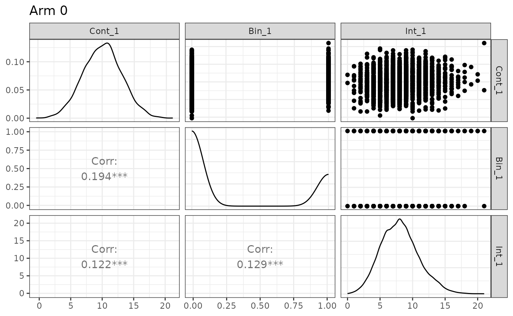
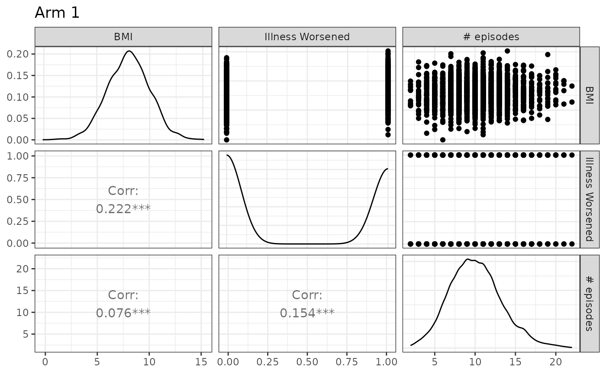
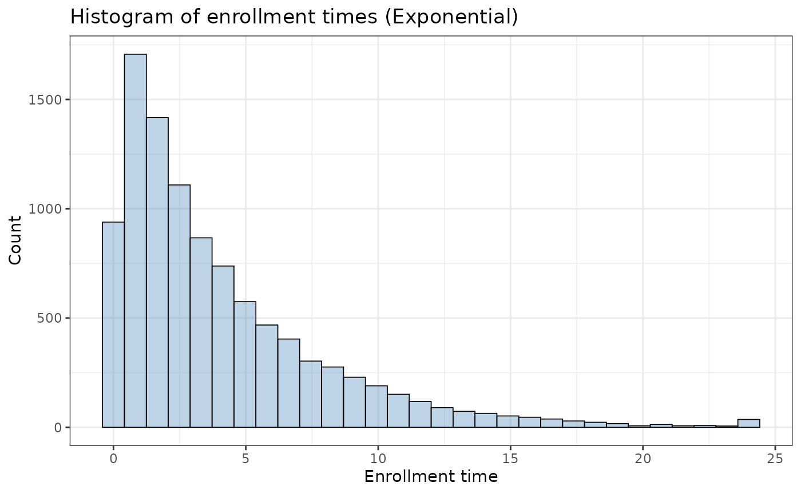
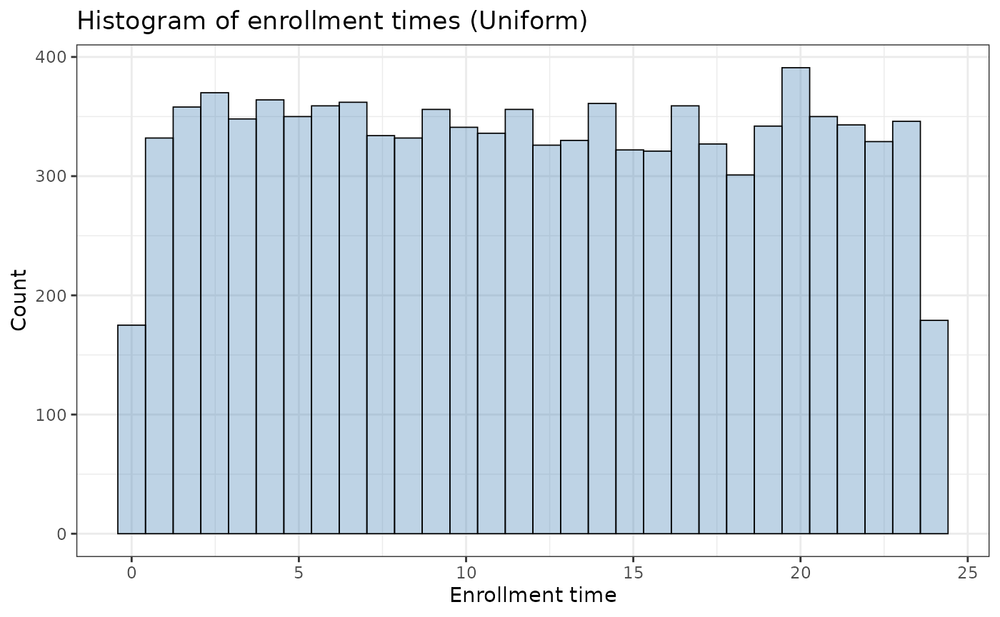
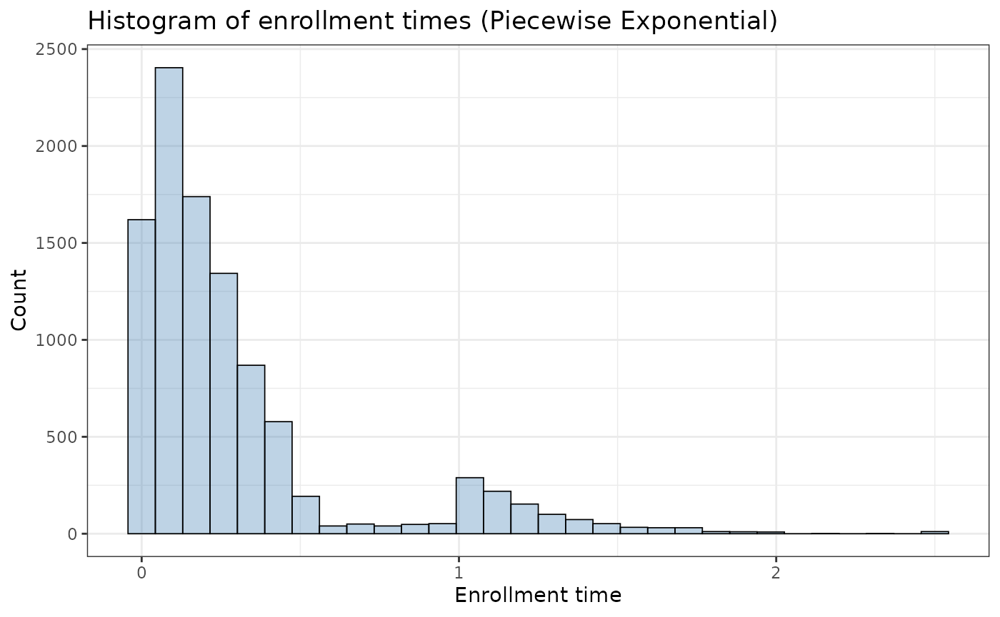

# A User Guide for the \`endpoints\` Package

``` r
library(endpoints)
library(tidyverse)
```

## Introduction

The
[`makeData()`](https://boehringer-ingelheim.github.io/endpoints/reference/makeData.md)
framework is designed to simulate flexible clinical trial datasets with
a mix of endpoint types and trial-design features, while keeping the
interface simple and modular. It supports both straightforward
single-endpoint simulations and more complex multivariate settings with
correlated outcomes generated through a Gaussian copula (NORTA-style)
construction. The function also accommodates:

- trials with multiple treatment arms
- time-to-event outcomes with censoring (competing or semi-competing
  risks)
- realistic trial logistics such as stochastic enrollment and
  administrative follow-up

In this vignette, we illustrate the package through a sequence of
examples, beginning with simple single-endpoint simulations and
gradually introducing more advanced features.

## Quick Start: One Endpoint Simulations

The core function in `endpoints` is
[`makeData()`](https://boehringer-ingelheim.github.io/endpoints/reference/makeData.md),
which is used across all simulation settings. In the simplest case,
[`makeData()`](https://boehringer-ingelheim.github.io/endpoints/reference/makeData.md)
can simulate a single-endpoint trial with one or more treatment arms.

For one-endpoint simulations, the most important arguments are:

- `sample_size_per_group`: Sample size per treatment arm (scalar or
  vector)
- `endpoint_details`: A list of endpoint specifications (one sub-list
  per endpoint)

An optional argument used in multivariate settings is:

- `correlation_matrix`: A correlation matrix describing dependence
  across endpoints

This is discussed in later sections.

``` r
makeData(correlation_matrix = NULL,
  sample_size_per_group = 1000,
  endpoint_details = list(
    ...
    )
  )
```

### Specifying endpoints `endpoint_details`

The
[`makeData()`](https://boehringer-ingelheim.github.io/endpoints/reference/makeData.md)
function allows for four endpoint types, which are encoded via the
`endpoint_details` argument: continuous, binary, count and
time-to-event. We discuss each below.

#### Continuous

An example specification of a continuous endpoint is seen below:

``` r
c_ep1 <- list(
      endpoint_type = "continuous",
      baseline_mean = 10,
      sd            = c(3,2),
      trt_effect    = -2
    )
```

When generating continuous endpoints,
[`makeData()`](https://boehringer-ingelheim.github.io/endpoints/reference/makeData.md)
uses a Gaussian (normal) marginal distribution. The endpoint
specification arguments are:

- `baseline_mean`: Mean in the control group.
- `sd`: If a scalar is provided, a common SD is used across groups. If a
  vector is provided, it specifies arm-specific SDs.
- `trt_effect = NULL`: Mean difference(s) for treatment group(s)
  relative to control. A scalar is used for one treatment arm; a vector
  may be used for multiple treatment arms. If `NULL`, only control-group
  data are generated.

For a two-arm study, `trt_effect = -2` implies
`treatment mean = baseline_mean - 2`

``` r
simple1 <- makeData(correlation_matrix = NULL,
  sample_size_per_group = 1000,
  SEED = 1,
  endpoint_details = list(c_ep1)
  )
```

A quick summary of the simulation details is displayed when printing the
resulting object:

``` r
simple1
```

    ## <makeDataSim>
    ##   n =2000
    ##   n_arms =2
    ##   endpoints =1
    ##   target_correlation =FALSE
    ##   single_endpoint_mode =TRUE
    ##   control_only =FALSE
    ##   n_by_arm = 0:1000, 1:1000
    ##   endpoint_types = continuous
    ## 
    ##   data (head):
    ##             Cont_1 trt
    ## 1 8.12063857862128   0
    ## 2  9.0212999043454   0
    ## 3 10.5509299725547   0
    ## 4 13.9893977783661   0
    ## 5 7.49311413608736   0
    ## ⋮                ⋮   ⋮

To confirm the distributions have the correct parameters, we can use the
summary function

``` r
knitr::kable(summary(simple1)$continuous)
```

| endpoint | arm | input_baseline_mean | input_sd | input_trt_effect | est_baseline_mean | est_trt_effect | est_resid_sd |
|:---------|----:|--------------------:|---------:|-----------------:|------------------:|---------------:|-------------:|
| Cont_1   |   0 |                  10 |        3 |                0 |          10.02815 |       0.000000 |     2.999293 |
| Cont_1   |   1 |                  10 |        2 |               -2 |          10.02815 |      -2.102053 |     2.066130 |

From above, we see that the estimated baseline mean, treatment effect
and standard deviation parameter are all close to the true values.

The resulting simulated data set can be accessed from the main
`makeDataSim` object:

``` r
head(simple1$data)
```

    ##      Cont_1 trt
    ## 1  8.120639   0
    ## 2  9.021300   0
    ## 3 10.550930   0
    ## 4 13.989398   0
    ## 5  7.493114   0
    ## 6 13.817288   0

The response variable is automatically encoded as `Cont_1` to indicate
that it is the first continuous endpoint.

#### Binary

For binary outcomes, the event probability is modeled on the logit
scale. You may specify treatment effects either directly on the
probability scale (`trt_prob`) or on the log-odds scale (`trt_effect`),
but not both.

``` r
bin_ep1 <- list(
      endpoint_type  = "binary",
      baseline_prob  = 0.30,
      trt_prob = 0.45
    )
```

Binary endpoints are specified via the following arguments:

- `baseline_prob`: Probability of success in the control group.
- `trt_prob`: Scalar or vector of treatment-group success probabilities.
- `trt_effect = NULL`: Optional scalar or vector of treatment effects on
  the log-odds scale (relative to control). Only one of `trt_prob` or
  `trt_effect` may be supplied.

Once again we can confirm that the simulated data has the proper
characteristics:

``` r
simple2 <- makeData(correlation_matrix = NULL,
  sample_size_per_group = 1000,
  SEED = 2,
  endpoint_details = list(bin_ep1)
  )
knitr::kable(summary(simple2)$binary)
```

| endpoint | arm | input_baseline_prob | input_trt_logOR | input_trt_prob | est_baseline_prob | est_trt_logOR | est_prob |
|:---------|----:|--------------------:|----------------:|---------------:|------------------:|--------------:|---------:|
| Bin_1    |   0 |                 0.3 |       0.0000000 |           0.30 |             0.302 |      0.000000 |    0.302 |
| Bin_1    |   1 |                 0.3 |       0.6466272 |           0.45 |             0.302 |      0.641161 |    0.451 |

#### Count

To generate count outcomes, we use the zero-inflated negative binomial
distribution with a log-link function. The parameterization arguments
are as follows:

``` r
int_ep1 <- list(
      endpoint_type = "count",
      baseline_mean = 8,    
      trt_count = 10,
      size          = 100, # approximate Poisson       
      p_zero        = 0     
    )
```

- `baseline_mean`: Mean count in the control group.
- `trt_count`: Scalar or vector of treatment-group mean counts.
- `trt_effect = NULL`: Optional scalar or vector of treatment effects on
  the log rate-ratio scale. Only one of `trt_count` or `trt_effect` may
  be supplied.
- `size`: Negative binomial dispersion parameter (larger values reduce
  overdispersion and approach the Poisson limit). In the
  parameterization used, the variance of the distribution is equal to
  \\\mu + \frac{\mu^2}{\phi}\\. Here, `size` controls \\\phi\\.
- `p_zero`: Zero-inflation probability.

An example use can be seen below:

``` r
simple3 <- makeData(correlation_matrix = NULL,
  sample_size_per_group = 1000,
  SEED = 2,
  endpoint_details = list(int_ep1)
  )
knitr::kable(summary(simple3)$count)
```

| endpoint | arm | input_baseline_mean | input_trt_logRR | input_trt_mean | input_size | input_p_zero | est_baseline_mean | est_trt_logRR | est_size | obs_mean | obs_p0 |
|:---------|----:|--------------------:|----------------:|---------------:|-----------:|-------------:|------------------:|--------------:|---------:|---------:|-------:|
| Int_1    |   0 |                   8 |       0.0000000 |              8 |        100 |            0 |             7.987 |     0.0000000 | 54.55504 |    7.987 |      0 |
| Int_1    |   1 |                   8 |       0.2231436 |             10 |        100 |            0 |             7.987 |     0.2321426 | 54.55504 |   10.074 |      0 |

*Note:* When `size` is large, the negative binomial approaches a Poisson
distribution. In those cases, the dispersion parameter may be difficult
to estimate precisely from a single simulated dataset (e.g., via
[`MASS::glm.nb()`](https://rdrr.io/pkg/MASS/man/glm.nb.html)), which is
usually not a practical concern for simulation.

#### Time-to-Event Endpoints

Time-to-event endpoints are supported through exponential event-time
models with optional independent censoring, fatal/non-fatal event logic,
administrative censoring, and stochastic enrollment. We defer details to
the dedicated section below.

## Multiple Treatment Arms

To extend the above simulations to settings with several treatment
groups, we can simply replace scalar inputs with vectors. In general, if
there are \\G\\ total study arms (including control), then
treatment-specific vectors (e.g., `trt_prob`, `trt_effect`, `sd`) should
typically have length \\G-1\\, corresponding to the non-control arms in
order.

For example, imagine we have a 4-grp study with a binary endpoint:

``` r
bin_4grp <- list(
      endpoint_type  = "binary",
      baseline_prob  = 0.30,
      trt_prob = c(0.35, 0.40, 0.45)
    )

sim_bin4grp <- makeData(correlation_matrix = NULL,
  sample_size_per_group = c(100,200,400,400),
  SEED = 123,
  endpoint_details = list(bin_4grp)
  )
sim_bin4grp
```

    ## <makeDataSim>
    ##   n =1100
    ##   n_arms =4
    ##   endpoints =1
    ##   target_correlation =FALSE
    ##   single_endpoint_mode =TRUE
    ##   control_only =FALSE
    ##   n_by_arm = 0:100, 1:200, 2:400, 3:400
    ##   endpoint_types = binary
    ## 
    ##   data (head):
    ##   Bin_1 trt
    ## 1     0   0
    ## 2     1   0
    ## 3     0   0
    ## 4     1   0
    ## 5     1   0
    ## ⋮     ⋮   ⋮

Once again we can ensure the distributions are being simulated correctly
by calling `summary`:

``` r
knitr::kable(summary(sim_bin4grp)$binary)
```

| endpoint | arm | input_baseline_prob | input_trt_logOR | input_trt_prob | est_baseline_prob | est_trt_logOR | est_prob |
|:---------|----:|--------------------:|----------------:|---------------:|------------------:|--------------:|---------:|
| Bin_1    |   0 |                 0.3 |       0.0000000 |           0.30 |              0.29 |     0.0000000 |    0.290 |
| Bin_1    |   1 |                 0.3 |       0.2282587 |           0.35 |              0.29 |     0.1871990 |    0.330 |
| Bin_1    |   2 |                 0.3 |       0.4418328 |           0.40 |              0.29 |     0.4690414 |    0.395 |
| Bin_1    |   3 |                 0.3 |       0.6466272 |           0.45 |              0.29 |     0.6744902 |    0.445 |

## Correlated Endpoints with Gaussian Copula

Gaussian copulas provide a flexible way to generate multivariate
outcomes with user-specified marginal distributions and dependence. Let
\\\mathbf{Z} = (Z_1,\dots,Z_J)^\top \sim \mathrm{MVN}(\mathbf{0},
\Sigma_Z)\\. Applying the probability integral transform componentwise
gives

\\ X_j = F_j^{-1}\\\Phi(Z_j)\\, \qquad j=1,\dots,J, \\

where \\\Phi\\ is the standard normal CDF and \\F_j^{-1}\\ is the
inverse CDF (quantile function) of the desired marginal distribution for
endpoint \\j\\. This construction preserves the chosen marginals and
induces dependence across endpoints through the Gaussian copula.

Because Pearson correlation is generally **not** preserved under
nonlinear monotone transformations,
[`makeData()`](https://boehringer-ingelheim.github.io/endpoints/reference/makeData.md)
optionally uses numerical calibration (`target_correlation = TRUE`) to
find a latent Gaussian correlation matrix that approximately reproduces
the requested Pearson correlation matrix on the observed endpoint scale.

**Important:** When `target_correlation = FALSE`, the supplied
`correlation_matrix` is used directly as the latent Gaussian correlation
matrix (the copula parameter), not as a calibrated Pearson correlation
matrix on the observed endpoint scale. It is recommended that this
option is set to `TRUE`. See Cario & Nelson (1997) for more details.

### Creating the Correlation Matrix

To create a correlation matrix, we use the
[`corr_make()`](https://boehringer-ingelheim.github.io/endpoints/reference/corr_make.md)
function which has two arguments:

- `num_endpoints`: The number of correlated endpoints to generate
- `values`: Pairwise correlations specified as a 3-column object (e.g.,
  matrix or data frame), where each row has the form `(i, j, rho)`
  giving the correlation between endpoints `i` and `j`. Unspecified
  pairs default to a correlation value of 0.

Consider a trial with 3 endpoints with the following correlation:

``` r
corMat_3 <- corr_make(
  num_endpoints =   3,
  values = rbind(
    c(1,2,.2), c(1,3,.1),
    c(2,3,.15)
  )
) 
```

### Simulating Correlated Endpoints

Using the endpoints defined above, we can now generate a trial with
three correlated endpoints, one continuous, one binary and one count:

``` r
sim_3eps <- makeData(
  correlation_matrix    = corMat_3,
  sample_size_per_group = 3000,
  SEED = 777,
  endpoint_details = list(
    c_ep1,
    bin_ep1,
    int_ep1
  )
)
```

To quickly confirm that the estimated correlation between endpoints is
close to the correlation specified, we use the `summary` function:

Show summary(sim_3eps)


    n_arms: 2 

    Target correlation:
         [,1] [,2] [,3]
    [1,]  1.0 0.20 0.10
    [2,]  0.2 1.00 0.15
    [3,]  0.1 0.15 1.00

    Estimated correlation (by arm):

    arm_0:
           Cont_1 Bin_1 Int_1
    Cont_1  1.000 0.194 0.122
    Bin_1   0.194 1.000 0.129
    Int_1   0.122 0.129 1.000

    arm_1:
           Cont_1 Bin_1 Int_1
    Cont_1  1.000 0.222 0.076
    Bin_1   0.222 1.000 0.154
    Int_1   0.076 0.154 1.000

    Continuous endpoints (endpoint x arm):
      endpoint arm input_baseline_mean input_sd input_trt_effect est_baseline_mean
    1   Cont_1   0                  10        3                0          10.05584
    2   Cont_1   1                  10        2               -2          10.05584
      est_trt_effect est_resid_sd
    1       0.000000     2.986202
    2      -2.058158     1.993636

    Binary endpoints (endpoint x arm):
      endpoint arm input_baseline_prob input_trt_logOR input_trt_prob
    1    Bin_1   0                 0.3       0.0000000           0.30
    2    Bin_1   1                 0.3       0.6466272           0.45
      est_baseline_prob est_trt_logOR  est_prob
    1             0.297     0.0000000 0.2970000
    2             0.297     0.6945707 0.4583333

    Count endpoints (endpoint x arm):
      endpoint arm input_baseline_mean input_trt_logRR input_trt_mean input_size
    1    Int_1   0                   8       0.0000000              8        100
    2    Int_1   1                   8       0.2231436             10        100
      input_p_zero est_baseline_mean est_trt_logRR est_size  obs_mean       obs_p0
    1            0          8.070667     0.0000000 150.3706  8.070667 0.0006666667
    2            0          8.070667     0.2223502 150.3706 10.080333 0.0000000000

From the summary above, we see that the within-arm correlation is close
to that specified in `corMat_3` and that the marginal distributions have
the correct distributional characteristics. Note that because the
correlation calibration is numerical (and summaries are based on finite
samples), small discrepancies between the requested and empirical
within-arm correlations are expected.

Here we also introduce the `plot` function, which allows users to
quickly confirm simulation details:

``` r
plot(sim_3eps)
```



Note that different experimental arms can be plotted by toggling the
`arm` argument, and that names may also be supplied:

``` r
plot(sim_3eps,arm=1,names=c("BMI","Illness Worsened","# episodes"))
```



The code can easily be modified to accommodate several treatment groups
by applying the conventions discussed in the previous section.

## Time-to-event Endpoints and Censoring

In
[`makeData()`](https://boehringer-ingelheim.github.io/endpoints/reference/makeData.md),
all time-to-event (TTE) endpoints are distributed as exponential random
variables \\f(x;\lambda) = \lambda e^{-\lambda x}\\. They are encoded as
elements in `endpoint_details` as follows:

- `baseline_rate`: The exponential event-rate parameter \\\lambda\\ for
  the control group (so the mean event time is \\1/\lambda\\).
- `trt_effect`: Scalar or vector of treatment effects on the log
  hazard-ratio scale.
- `censoring_rate = NULL`: Exponential censoring-rate parameter for
  independent censoring (if `NULL`, no random censoring is applied).
- `fatal_event`: If `TRUE`, the endpoint is treated as fatal and censors
  subsequent non-fatal TTE endpoints. See below for details.

``` r
tte_ep1 <- list(
      endpoint_type  = "tte",
      baseline_rate  = 1/24,        
      trt_effect     = log(0.80),   
      censoring_rate = NULL,        
      fatal_event    = F     
    )
```

**Censoring**

For a time-to-event endpoint, for the \\i^{th}\\ patient we observe
\\X_i = \min\\T_i, C_i\\\\ where \\T \sim Exp(\lambda_e)\\ is the event
time and \\C_i \sim Exp(\lambda_c)\\ is the censoring time. For the
primary terminal event (or a non-terminal event when there are no
terminal events), the probability of observing an event is \\P({T}\_i \<
{C}\_i) = \int^\infty_0\lambda_ee^{-\lambda_ex}e^{-\lambda_cx} =
\frac{\lambda\_{e}}{\lambda_e+\lambda_c},\\

which can be used to select a censoring rate that produces the
user-specified event rate. In the example from the code chunk above, if
we want to select a censoring rate such that we observe an event rate of
.9, some algebra yields \\\lambda_c = \frac{1/24}{0.90} -\frac{1}{24} =
1/216\\. This can be calculated by using the helper function
[`rate_from_prob()`](https://boehringer-ingelheim.github.io/endpoints/reference/rate_from_prob.md):

``` r
lambda_c <- rate_from_prob(
  target_prob = 0.90, # target proportion of patients with events
  mode = "simple", 
  event_rate = 1 / 24 # rate parameter for primary event
)
print(paste0("1","/",1/lambda_c))
```

    ## [1] "1/216"

When there are semi-competing risks, and the TTE endpoints have low
correlation, the event rate for the secondary, non-fatal TTE endpoint
can be approximated as
\\\frac{\lambda\_{e2}}{\lambda\_{e1}+\lambda\_{c1}+\lambda\_{e2}+\lambda\_{c2}}\\
where the subscripts \\1, 2\\ denote the first and secondary endpoints.
The above formula is meant only as an approximation as the dependence
(induced by the copula) between \\X_1\\ and \\X_2\\ is not accounted
for. This approximation can also be handled by the helper function. In
this case, the output is the rate of the censoring mechanism for the
secondary endpoint.

``` r
rate_from_prob(
  target_prob = 0.20, # hypothetical example
  mode = "semi-competing",
  fatal_event_rate = 1 / 50,
  fatal_censor_rate = 1 / 16.667,
  nonfatal_event_rate = 1 / 35
)
```

    ## [1] 0.03428691

Please see `?rate_from_prob()` for details.

We also note here that the censoring mechanism is independent of the
copula so pairwise correlations involving censored TTE endpoints
generally will not equal the specified coefficient. To confirm the
simulation is working as intended, we recommend first simulating the
data without censoring, confirming the correlation, then re-generating
the data with censoring.

**Fatal Events**

Let \\X_1\\ be a fatal event and \\X_2\\ be a non-fatal event, then we
write \\X_2 = \min\\T_1, C_1, T_2,C_2\\\\. That is, we cannot observe
any event that occurs after a fatal event occurs **or** is censored.

If a non-fatal event occurs before a fatal event (\\T_2 \< \\T_1,
C_1,C_2\\\\), a fatal event can still be subsequently observed (or
censored). If a non-fatal event is censored before a fatal event (\\C_2
\< \\T_1, C_1,T_2\\\\), a fatal event can still be subsequently observed
(or censored), unless `non_fatal_censors_fatal = TRUE` is toggled in the
main
[`makeData()`](https://boehringer-ingelheim.github.io/endpoints/reference/makeData.md)
function. This is a global option for all TTEs simulated.

#### Semi-Competing Risks Example

We want to generate a data set with TTE endpoints, one fatal and one
non-fatal. The fatal event has an average time of 50 in the control
group, and 60 in the treatment group. We want an observed event rate of
.25 in the control group.

To solve for the needed log hazard ratio, we solve \\\frac{1}{60} =
\frac{1}{50} \cdot HR \to \text{HR} = .833\\. To solve for the censoring
rate, we solve \\\frac{1/50}{0.25} - \frac{1}{50} = 1/ 16.667\\.

For the second endpoint, we want a mean time of 35 for control group and
45 for treatment group, with an observed event rate of .45 for the
control group. To solve for the needed log hazard ratio, we solve
\\\frac{1}{45} = \frac{1}{35} \cdot HR \to \text{HR} = 0.778\\. To solve
for the censoring rate, we solve \\\frac{1/35}{0.45} - \frac{1}{35} = 1/
28.64\\.

We assume a correlation of .2 between the endpoints.

``` r
tte_fatal <-  list(
      endpoint_type  = "tte",
      baseline_rate  = 1/50,        
      trt_effect     = log(0.8333),   
      censoring_rate = 1/16.667,        
      fatal_event    = TRUE   
    ) 

tte_nonfatal <- list(
      endpoint_type  = "tte",
      baseline_rate  = 1/35,        
      trt_effect     = log(0.778),   
      censoring_rate = 1/28.64,        
      fatal_event    = FALSE 
    ) 
```

``` r
small_cor <- corr_make(
  num_endpoints = 2,
  values = rbind( c(1,2, 0.20)) # correlation
)

tte_ex <- makeData(
  correlation_matrix    = small_cor,
  sample_size_per_group = 5000,
  SEED = 321,
  endpoint_details = list( tte_fatal, tte_nonfatal),
  non_fatal_censors_fatal = FALSE
)
tte_ex
```

    ## <makeDataSim>
    ##   n =10000
    ##   n_arms =2
    ##   endpoints =2
    ##   target_correlation =TRUE
    ##   single_endpoint_mode =FALSE
    ##   control_only =FALSE
    ##   n_by_arm = 0:5000, 1:5000
    ##   endpoint_types = time-to-event, time-to-event
    ## 
    ##   data (head):
    ##               TTE_1             TTE_2 trt Status_1 Status_2
    ## 1  1.04727950385236  1.04727950385236   0        0        0
    ## 2  1.08654899491183  1.08654899491183   0        0        0
    ## 3  28.7011752270296  10.1710911152606   0        0        1
    ## 4   7.0854601196209  1.40421959333994   0        0        1
    ## 5 0.743645541628904 0.743645541628904   0        0        0
    ## ⋮                 ⋮                 ⋮   ⋮        ⋮        ⋮

And we can confirm our inputs:

Show summary(tte_ex)


    n_arms: 2 

    Target correlation:
         [,1] [,2]
    [1,]  1.0  0.2
    [2,]  0.2  1.0

    Estimated correlation (by arm):

    arm_0:
          TTE_1 TTE_2
    TTE_1 1.000 0.568
    TTE_2 0.568 1.000

    arm_1:
          TTE_1 TTE_2
    TTE_1 1.000 0.621
    TTE_2 0.621 1.000

    TTE endpoints (endpoint x arm):
      endpoint arm censor_col input_baseline_rate input_trt_logHR input_trt_HR
    1    TTE_1   0   Status_1          0.02000000       0.0000000       1.0000
    2    TTE_1   1   Status_1          0.02000000      -0.1823616       0.8333
    3    TTE_2   0   Status_2          0.02857143       0.0000000       1.0000
    4    TTE_2   1   Status_2          0.02857143      -0.2510288       0.7780
      est_trt_logHR est_trt_HR obs_event_rate   exp_rate
    1     0.0000000  1.0000000         0.2498 0.01993274
    2    -0.1826152  0.8330887         0.2168 0.01665117
    3     0.0000000  1.0000000         0.1852 0.02619647
    4    -0.2191347  0.8032135         0.1616 0.02094082

We emphasize once again that censoring and the presence of competing
risks can alter correlation (estimated vs expected) and marginal
distribution parameters. As mentioned before, we recommend first
generating data with no censoring or fatal events to confirm the overall
structure before introducing those elements.

In the [`summary()`](https://rdrr.io/r/base/summary.html) output for
simulated TTE endpoints, the column `exp_rate` reports the
**arm-specific exponential maximum likelihood estimate (MLE)** of the
event rate, computed from the observed times and event indicators after
censoring/fatal-event logic has been applied. For a given arm, this is

\\ \widehat{\lambda}\_{\text{exp}} = \frac{\sum_i \delta_i}{\sum_i X_i},
\\

where \\X_i\\ is the observed follow-up time for subject \\i\\ (possibly
censored), and \\\delta_i\in\\0,1\\\\ is the event indicator (1 = event
observed, 0 = censored).

This is the standard MLE for an exponential survival model with right
censoring. In the summary output:

- `obs_event_rate` is the observed proportion of subjects with an event
  (i.e., \\\bar\delta\\),
- `exp_rate` is the exponential rate estimate \\\sum \delta_i / \sum
  X_i\\,
- `est_trt_logHR` is the treatment log-hazard ratio estimated from a Cox
  model fit.

These quantities are related but not identical. In particular,
`exp_rate` is a **descriptive arm-level estimator** under an exponential
model assumption, while `est_trt_logHR` comes from a **semi-parametric
Cox model**.

Because censoring, administrative censoring, and fatal-event truncation
modify the observed follow-up times and event indicators, the estimated
`exp_rate` may differ from the user-specified `baseline_rate` (and
implied treatment-group rates), especially in small samples or when
censoring is heavy.

In this example, the arm-specific exp_rate values are close to the
data-generating exponential event rates (approximately \\1 / 50,1 / 60,1
/ 35\\, and \\1 / 45\\ ), which is expected here because the sample size
is large and censoring is independent; even though censoring changes the
observed event proportion, the exponential MLE \\\sum \delta_i / \sum
X_i\\ remains a consistent estimator of the event hazard under the
exponential model.

## Administrative Censoring & Stochastic Enrollment

### Administrative Censoring

Administrative censoring (which we denote as \\\mathcal{A}\\) is
controlled via `enrollment_details` argument, which is a list of
settings. Within `enrollment_details` administrative censoring is
toggled using `administrative_censoring = NULL`. If it is set to a
positive value, then any TTE event that occurs (or is censored) after
\\\mathcal{A}\\, is set to \\\mathcal{A}\\ as that is the limit of
follow-up.

To illustrate, we can re-run the example above, but this time setting a
24 time-unit limit:

``` r
 tte_ex_admin_cens <- makeData(
  correlation_matrix    = small_cor,
  sample_size_per_group = 5000,
  SEED = 321,
  endpoint_details = list( tte_fatal, tte_nonfatal),
  enrollment_details = list(
    administrative_censoring = 24
  ),
  non_fatal_censors_fatal = FALSE
)
```

Comparing the datasets, we now see patient 3 is administratively
censored at time 24:

``` r
head(tte_ex$data) %>% knitr::kable(.,caption = "Data without admin censoring")
```

|      TTE_1 |      TTE_2 | trt | Status_1 | Status_2 |
|-----------:|-----------:|----:|---------:|---------:|
|  1.0472795 |  1.0472795 |   0 |        0 |        0 |
|  1.0865490 |  1.0865490 |   0 |        0 |        0 |
| 28.7011752 | 10.1710911 |   0 |        0 |        1 |
|  7.0854601 |  1.4042196 |   0 |        0 |        1 |
|  0.7436455 |  0.7436455 |   0 |        0 |        0 |
| 18.4536996 |  7.1912254 |   0 |        1 |        0 |

Data without admin censoring

``` r
head(tte_ex_admin_cens$data) %>% knitr::kable(.,caption = "Data with admin censoring")
```

|      TTE_1 |      TTE_2 | trt | Status_1 | Status_2 | enrollTime |
|-----------:|-----------:|----:|---------:|---------:|-----------:|
|  1.0472795 |  1.0472795 |   0 |        0 |        0 |          0 |
|  1.0865490 |  1.0865490 |   0 |        0 |        0 |          0 |
| 24.0000000 | 10.1710911 |   0 |        0 |        1 |          0 |
|  7.0854601 |  1.4042196 |   0 |        0 |        1 |          0 |
|  0.7436455 |  0.7436455 |   0 |        0 |        0 |          0 |
| 18.4536996 |  7.1912254 |   0 |        1 |        0 |          0 |

Data with admin censoring

Note that an `enrollTime` column is automatically generated when using
this feature.

If there is no non-administrative censoring (e.g. no random drop-out),
we can solve for expected event rates by evaluating
\\\int\_{0}^{\mathcal{A}} \lambda e^{-\lambda x} dx = 1 - e^{-\lambda
x}\\. To solve for \\\lambda\\, we calculate
\\\frac{\ln(1-r)}{-\mathcal{A}}\\ where r is the desired event rate. For
example, if we want to simulate a 4-year trial with a 20% fatal event
rate, we need to set the baseline hazard to `log(1-.2)/(-4) = .0558.`
Once again, we can use the helper function
[`rate_from_prob()`](https://boehringer-ingelheim.github.io/endpoints/reference/rate_from_prob.md)
to solve this math:

``` r
rate_from_prob(
  target_prob = 0.20,
  mode = "admin",
  admin_time = 4
)
```

    ## [1] 0.05578589

which can then be used in
[`makeData()`](https://boehringer-ingelheim.github.io/endpoints/reference/makeData.md)

``` r
admin_ex2 <- makeData(
  correlation_matrix    = NULL,
  sample_size_per_group = 5000,
  SEED = 12,
  endpoint_details = list( 
    list(
      endpoint_type  = "tte",
      baseline_rate  = .0558,        
      trt_effect     = 0,   
      fatal_event    = TRUE ) ),
  enrollment_details = list(
    administrative_censoring = 4
  ),
  non_fatal_censors_fatal = FALSE
)
obs_rates <- summary(admin_ex2)$tte$obs_event_rate
print(paste0("Observed event rate for control group is: ", round(obs_rates[1],2)))
```

    ## [1] "Observed event rate for control group is: 0.2"

### Stochastic Enrollment

By default, all patients are enrolled on day 0 of the trial. To simulate
a more realistic trial, probabilistic enrollment is controlled via the
following arguments:

- `enrollment_distribution = c("none","uniform","exponential","piecewise")`:
  This specifies the enrollment-time distribution (default is `"none"`).
  If `"uniform"`, enrollment time is \\\mathbf{U}\[0,\mathcal{A}\]\\,
  where \\\mathcal{A}\\ is the time of administrative censoring. If
  `"exponential"`, enrollment time is based on an exponential
  distribution (see `enrollment_exponential_rate`). If `"piecewise"`,
  enrollment follows a piecewise exponential distribution. This option
  requires specifying `piecewise_enrollment_cutpoints` and
  `piecewise_enrollment_rates` (see examples below).
- `enrollment_exponential_rate = NULL`: The rate for the exponential
  distribution if `enrollment_distribution = "exponential"`.
- `piecewise_enrollment_cutpoints = NULL`: The time points defining the
  bins for the piecewise enrollment pattern.
- `piecewise_enrollment_rates = NULL`: The rates for each exponential
  distribution within each time bin.

If a user specifies stochastic enrollment and administrative censoring,
then maximum potential time-on-study is \\\mathcal{A} - T_E\\, where
\\T_E\\ is time of enrollment. If we re-run the example from above,

``` r
 tte_admin_cens_exp_enroll <- makeData(
  correlation_matrix    = small_cor,
  sample_size_per_group = 5000,
  SEED = 321,
  endpoint_details = list( tte_fatal, tte_nonfatal),
  enrollment_details = list(
    administrative_censoring = 24,
     enrollment_distribution = "exponential",
    enrollment_exponential_rate = 1/4
  ),
  non_fatal_censors_fatal = FALSE
)
knitr::kable(head(tte_admin_cens_exp_enroll$data),caption = "Data with admin censoring and stochastic enrollment")
```

|      TTE_1 |      TTE_2 | trt | Status_1 | Status_2 | enrollTime |
|-----------:|-----------:|----:|---------:|---------:|-----------:|
|  1.0472795 |  1.0472795 |   0 |        0 |        0 |  1.5548657 |
|  1.0865490 |  1.0865490 |   0 |        0 |        0 |  4.4949425 |
| 19.7241782 | 10.1710911 |   0 |        0 |        1 |  4.2758218 |
|  7.0854601 |  1.4042196 |   0 |        0 |        1 |  3.9579370 |
|  0.7436455 |  0.7436455 |   0 |        0 |        0 |  1.1697326 |
| 18.4536996 |  7.1912254 |   0 |        1 |        0 |  0.8527512 |

Data with admin censoring and stochastic enrollment

we now see that patient 3 is now censored at time 19.72 (instead of time
24), as their enrollment time is 4.28. From the code above, we observed
an enrollment curve of:

``` r
ggplot2::ggplot(tte_admin_cens_exp_enroll$data, aes(x = enrollTime)) +
  geom_histogram(bins = 30,fill = "steelblue", alpha = 0.35,
    color = "black",linewidth = 0.3) +
  labs(
    x = "Enrollment time",
    y = "Count",
    title = "Histogram of enrollment times (Exponential)") +
  theme_bw()
```



The function also supports a simple enrollment (uniform) curve:

``` r
ex_unif <- makeData(
  correlation_matrix    = small_cor,
  sample_size_per_group = 5000,
  SEED = 321321,
  endpoint_details = list( tte_fatal, tte_nonfatal),
  enrollment_details = list(
    administrative_censoring = 24,
     enrollment_distribution = "uniform"
  ),
  non_fatal_censors_fatal = FALSE
)

ggplot2::ggplot(ex_unif$data, aes(x = enrollTime)) +
  geom_histogram(bins = 30,fill = "steelblue", alpha = 0.35,
    color = "black",linewidth = 0.3) +
  labs(
    x = "Enrollment time",
    y = "Count",
    title = "Histogram of enrollment times (Uniform)") +
  theme_bw()
```



Stochastic enrollment does not change the underlying event-time
generation mechanism (i.e., the event hazard parameters), but it can
materially change observed follow-up time and observed event proportions
when administrative censoring is present.

**Piecewise Enrollment**

In some trials, we may expect varied enrollment throughout the study
period (e.g. heavy \\\rightarrow\\ light \\\rightarrow\\ medium
\\\rightarrow\\ heavy) due to seasonal trends or logistic constraints.
For example,

``` r
pw_example <- makeData(
  correlation_matrix    = NULL,
  sample_size_per_group = 5000,
  SEED = 321,
  endpoint_details = list( 
    list(
      endpoint_type  = "tte",
      baseline_rate  = .0558,        
      trt_effect     = 0,   
      fatal_event    = TRUE )),
  enrollment_details = list(
    administrative_censoring = 4,
     enrollment_distribution = "piecewise",
      piecewise_enrollment_cutpoints = c(0, .5, 1, 2, 2.5),
                piecewise_enrollment_rates  = c(4, .5, 4, .5)
  ),
  non_fatal_censors_fatal = FALSE
)
```

yields the following pattern:

``` r
ggplot2::ggplot(pw_example$data, aes(x = enrollTime)) +
  geom_histogram(bins = 30,fill = "steelblue", alpha = 0.35,
    color = "black",linewidth = 0.3) +
  labs(
    x = "Enrollment time",
    y = "Count",
    title = "Histogram of enrollment times (Piecewise Exponential)") +
  theme_bw()
```



For transparency, the sampler proceeds as follows:

- For each subject, it simulates the waiting time until enrollment,
  starting from time 0.
- It checks interval by interval: If a randomly drawn exponential
  waiting time (using the interval’s rate) falls within that interval,
  the subject enrolls at that time.
- If not, the process moves to the next interval (with its potentially
  different rate), adding the completed interval’s duration to the
  subject’s time.
- This repeats until enrollment occurs or the final cutpoint is reached.
- After the loop finishes (either by an enrollment event occurring or by
  reaching the end of all intervals), it ensures the subject’s
  enrollment time does not exceed the final defined cutpoint.

**Piecewise Enrollment with Proportions**

Assume a 24-month trial with a target enrollment of \\N = 1{,}100\\
patients. Suppose we want the enrollment pattern to be:

- 10% enrolled during months 0–8,
- 35% enrolled during months 8–16, and
- 55% enrolled during months 16–24.

To achieve this piecewise exponential enrollment pattern, we solve for
the exponential rates in each interval using basic probability.

First, set the cutpoints to define the three enrollment windows
`piecewise_enrollment_cutpoints = c(0, 8, 16, 24)`. This creates three
time bins: \\\[0,8),\[8,16)\\, and \\\[16,24\]\\. Next, solve for
\\\lambda_1\\ so that \\10 \\\\ of patients enroll before month 8. For
an exponential waiting time in the first interval,

\\ P(T\<8)=1-e^{-8 \lambda_1}=0.10 . \\

Rearranging,

\\\begin{align\*} 1 - e^{-8\lambda_1} &= 0.10 \\ e^{-8\lambda_1} &= 0.90
\\ -8\lambda_1 &= \log(0.90) \\ \lambda_1 &= -\frac{\log(0.90)}{8}.
\end{align\*}\\

Second, solve for \\\lambda_2\\ so that \\35 \\\\ of patients enroll in
the second bin (months \\8-16\\ ). This probability is

\\ P(8 \leq T\<16)=P(T \geq 8) P(T-8\<8 \mid T \geq 8)=e^{-8
\lambda_1}\left(1-e^{-8 \lambda_2}\right)=0.35 . \\

Using \\e^{-8 \lambda_1}=0.90\\, we get \\\begin{align\*} 0.90\left(1 -
e^{-8\lambda_2}\right) &= 0.35 \\ 1 - e^{-8\lambda_2} &=
\frac{0.35}{0.90} \\ e^{-8\lambda_2} &= 1 - \frac{0.35}{0.90} \\
\lambda_2 &= -\frac{1}{8}\log\left(1 - \frac{0.35}{0.90}\right).
\end{align\*}\\ The third rate, \\\boldsymbol{\lambda}\_3\\, does not
affect the overall proportion enrolled in months 16-24 (that remaining
\\55 \\\\ is already determined by \\\lambda_1\\ and \\\lambda_2\\ ).
However, \\\lambda_3\\ does affect the shape of the enrollment-time
distribution within the final bin, here we set this value to 0.25.

Putting this together:

``` r
# define rates from calculations above
rate1 <- -log(.9)/8
rate2 <- -log(1-.35/exp(-rate1*8))/8
  

pw_example2 <- makeData(
  correlation_matrix    = NULL,
  sample_size_per_group = 5000,
  SEED = 321,
  endpoint_details = list( 
    list(
      endpoint_type  = "tte",
      baseline_rate  = .0558,        
      trt_effect     = 0,   
      fatal_event    = TRUE)),
  enrollment_details = list(
    administrative_censoring = 24,
     enrollment_distribution = "piecewise",
    piecewise_enrollment_cutpoints = c(0, 8, 16, 24),
  piecewise_enrollment_rates  = c(rate1, rate2, .25)
  ),
  non_fatal_censors_fatal = FALSE
)
```

And to double check enrollment scheme:

``` r
pw_example2$data %>%
    dplyr::summarize(.,
  Bin1 = mean(enrollTime < 8),
  Bin2 = mean(enrollTime >= 8 & enrollTime < 16),
  Bin3 = mean(enrollTime >= 16)
) %>% knitr::kable(.,caption="Observed enrollment proportion by time period")
```

|  Bin1 |   Bin2 |   Bin3 |
|------:|-------:|-------:|
| 0.107 | 0.3471 | 0.5459 |

Observed enrollment proportion by time period

## References

Cario, M. C., & Nelson, B. L. (1997). *Modeling and generating random
vectors with arbitrary marginal distributions and correlation matrix*
(pp. 1-19). Technical Report, Department of Industrial Engineering and
Management Sciences, Northwestern University, Evanston, Illinois.
